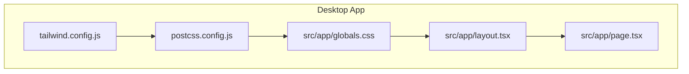
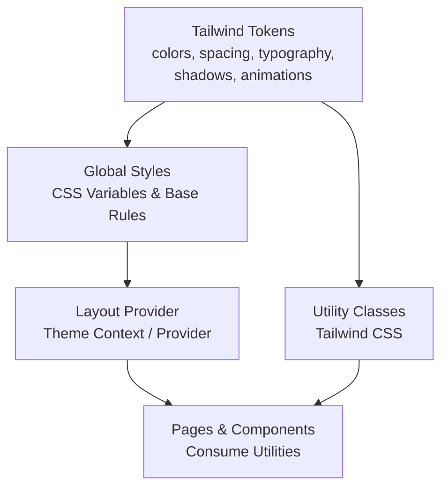
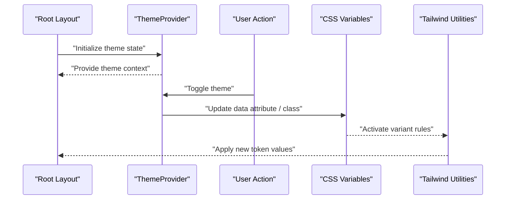
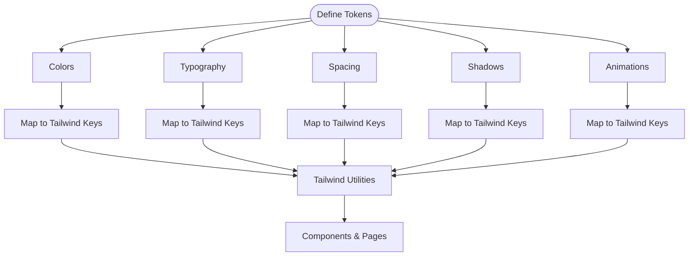
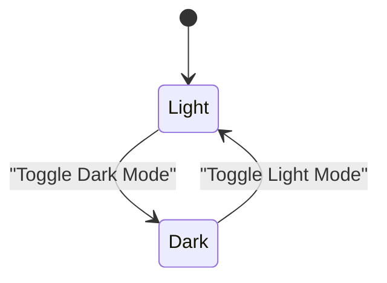
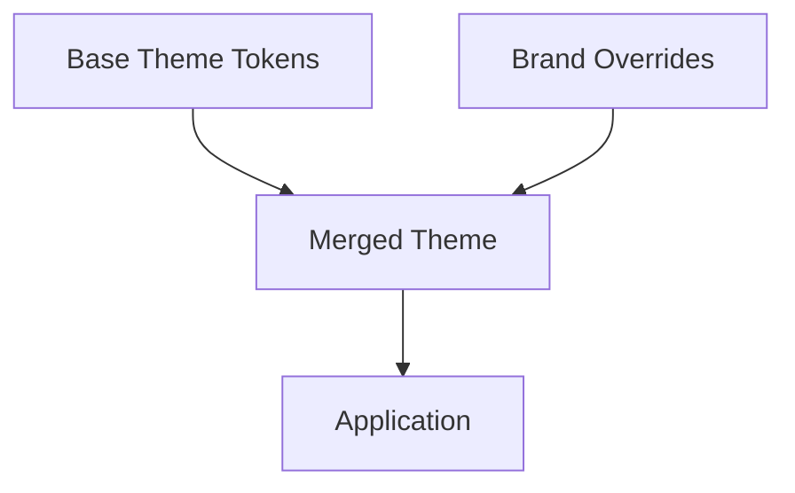
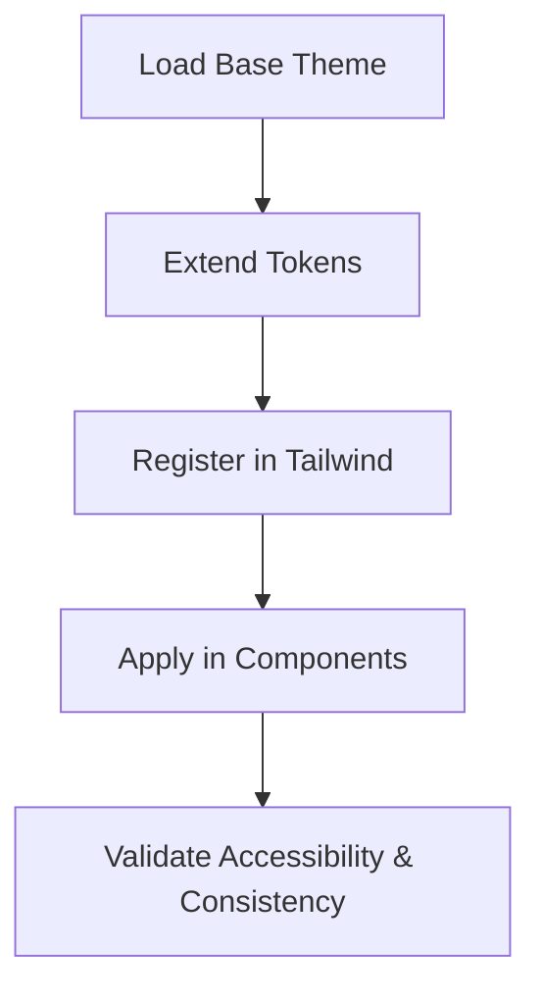
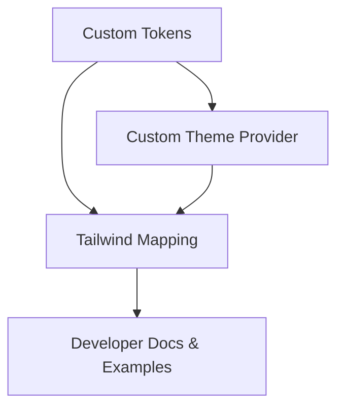
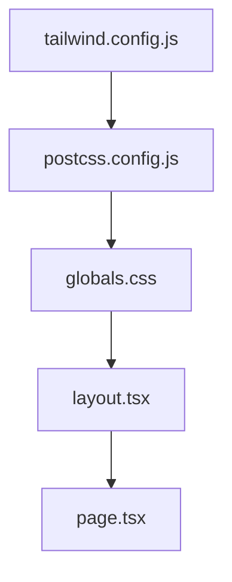

# Theme System

<cite>
**Referenced Files in This Document**
- [package.json](file://packages/theme/package.json)
- [tailwind.config.js](file://apps/desktop/tailwind.config.js)
- [globals.css](file://apps/desktop/src/app/globals.css)
- [layout.tsx](file://apps/desktop/src/app/layout.tsx)
- [page.tsx](file://apps/desktop/src/app/page.tsx)
- [postcss.config.js](file://apps/desktop/postcss.config.js)
- [tsconfig.json](file://apps/desktop/tsconfig.json)
</cite>

## Table of Contents
1. [Introduction](#introduction)
2. [Project Structure](#project-structure)
3. [Core Components](#core-components)
4. [Architecture Overview](#architecture-overview)
5. [Detailed Component Analysis](#detailed-component-analysis)
6. [Dependency Analysis](#dependency-analysis)
7. [Performance Considerations](#performance-considerations)
8. [Troubleshooting Guide](#troubleshooting-guide)
9. [Conclusion](#conclusion)
10. [Appendices](#appendices)

## Introduction
This document explains the theme system used across the project, focusing on color palettes, typography scales, spacing units, shadows, and animation timings. It also covers how to customize themes, create brand-specific designs, implement dark mode support, and use the theme provider and token system for dynamic switching. Finally, it provides guidance for extending existing themes and building completely custom design systems.

## Project Structure
The theme-related configuration is primarily defined at the application layer using Tailwind CSS and PostCSS, with global styles applied via a root stylesheet. The desktop app demonstrates the typical setup:
- Tailwind configuration defines tokens such as colors, spacing, typography, shadows, and animations.
- Global CSS applies base styles and theme variables.
- Layout and page files consume these tokens through utility classes.

**Diagram sources**
- [tailwind.config.js](file://apps/desktop/tailwind.config.js)
- [postcss.config.js](file://apps/desktop/postcss.config.js)
- [globals.css](file://apps/desktop/src/app/globals.css)
- [layout.tsx](file://apps/desktop/src/app/layout.tsx)
- [page.tsx](file://apps/desktop/src/app/page.tsx)

**Section sources**
- [tailwind.config.js](file://apps/desktop/tailwind.config.js)
- [postcss.config.js](file://apps/desktop/postcss.config.js)
- [globals.css](file://apps/desktop/src/app/globals.css)
- [layout.tsx](file://apps/desktop/src/app/layout.tsx)
- [page.tsx](file://apps/desktop/src/app/page.tsx)

## Core Components
- Color Palettes: Defined in Tailwind configuration under color keys. These include semantic tokens (e.g., primary, secondary, surface, text) and neutral scales. Use them consistently across components to maintain visual hierarchy and accessibility.
- Typography Scale: Configured via font families, sizes, weights, line heights, and letter spacing. Establish a type scale that maps to UI elements like headings, body, captions, and code.
- Spacing Units: Centralized in the spacing scale to ensure consistent margins, paddings, gaps, and layout dimensions. Prefer relative units where appropriate and keep breakpoints aligned with spacing rhythm.
- Shadows: Define elevation levels for surfaces, cards, overlays, and focus states. Keep shadow values subtle and accessible, especially in high-contrast or dark modes.
- Animation Timings: Standardize durations, easing curves, and keyframes for transitions, micro-interactions, and loading indicators. Reuse tokens to avoid ad-hoc timing values.

How to apply tokens:
- In JSX/TSX, use Tailwind utility classes mapped to your tokens (e.g., color, spacing, typography).
- In CSS, reference CSS variables if you expose tokens globally for non-Tailwind areas.

**Section sources**
- [tailwind.config.js](file://apps/desktop/tailwind.config.js)
- [globals.css](file://apps/desktop/src/app/globals.css)

## Architecture Overview
The theme architecture follows a layered approach:
- Token Layer: Central definitions in Tailwind config and global CSS variables.
- Utility Layer: Tailwind utilities compose tokens into reusable classes.
- Application Layer: Components and pages consume utilities; layout sets up providers and global context.

**Diagram sources**
- [tailwind.config.js](file://apps/desktop/tailwind.config.js)
- [postcss.config.js](file://apps/desktop/postcss.config.js)
- [globals.css](file://apps/desktop/src/app/globals.css)
- [layout.tsx](file://apps/desktop/src/app/layout.tsx)

## Detailed Component Analysis

### Theme Provider and Dynamic Switching
- Purpose: Provide theme context to the component tree, enabling dynamic switching between light and dark modes or brand variants.
- Typical responsibilities:
  - Initialize theme state from local storage or system preference.
  - Expose a setter to toggle themes.
  - Apply a data attribute or class to the root element to drive CSS variable overrides.
- Integration points:
  - Wrap the application root in the provider.
  - Ensure Tailwind’s dark mode strategy aligns with the provider’s attribute/class mechanism.

**Diagram sources**
- [layout.tsx](file://apps/desktop/src/app/layout.tsx)
- [globals.css](file://apps/desktop/src/app/globals.css)
- [tailwind.config.js](file://apps/desktop/tailwind.config.js)

**Section sources**
- [layout.tsx](file://apps/desktop/src/app/layout.tsx)
- [globals.css](file://apps/desktop/src/app/globals.css)
- [tailwind.config.js](file://apps/desktop/tailwind.config.js)

### Token System: Colors, Typography, Spacing, Shadows, Animations
- Colors:
  - Define semantic tokens (primary, secondary, accent, success, warning, error) and neutrals.
  - Map tokens to Tailwind color keys for direct usage in utilities.
- Typography:
  - Configure font families, sizes, weights, line heights, and letter spacing.
  - Create type scale entries (e.g., heading-1 to caption) and map to utilities.
- Spacing:
  - Establish a modular scale (e.g., multiples of a base unit).
  - Map to Tailwind spacing keys for consistent layout.
- Shadows:
  - Define elevation tokens (e.g., sm, md, lg, xl) and map to shadow utilities.
- Animations:
  - Define durations, easings, and keyframes for consistent motion.
  - Map to animation utilities for reuse.

**Diagram sources**
- [tailwind.config.js](file://apps/desktop/tailwind.config.js)
- [globals.css](file://apps/desktop/src/app/globals.css)

**Section sources**
- [tailwind.config.js](file://apps/desktop/tailwind.config.js)
- [globals.css](file://apps/desktop/src/app/globals.css)

### Dark Mode Support
- Strategy:
  - Use Tailwind’s dark mode variant (class or media query).
  - Maintain separate token sets for light and dark modes.
  - Persist user preference and sync with system preference.
- Implementation notes:
  - Ensure the provider toggles the correct attribute/class on the root element.
  - Verify all tokens have dark-mode mappings to avoid missing contrasts.
  - Test contrast ratios and readability across both modes.

**Diagram sources**
- [layout.tsx](file://apps/desktop/src/app/layout.tsx)
- [globals.css](file://apps/desktop/src/app/globals.css)
- [tailwind.config.js](file://apps/desktop/tailwind.config.js)

**Section sources**
- [layout.tsx](file://apps/desktop/src/app/layout.tsx)
- [globals.css](file://apps/desktop/src/app/globals.css)
- [tailwind.config.js](file://apps/desktop/tailwind.config.js)

### Brand-Specific Design Systems
- Approach:
  - Create a brand theme by overriding tokens (colors, typography, spacing, shadows, animations).
  - Provide a brand provider or configuration object to switch themes at runtime.
  - Encapsulate brand-specific components or style layers to minimize coupling.
- Example patterns:
  - Extend default tokens and add brand-only tokens.
  - Use composition to merge base and brand tokens.
  - Validate accessibility and consistency across screens.

**Diagram sources**
- [tailwind.config.js](file://apps/desktop/tailwind.config.js)
- [globals.css](file://apps/desktop/src/app/globals.css)

**Section sources**
- [tailwind.config.js](file://apps/desktop/tailwind.config.js)
- [globals.css](file://apps/desktop/src/app/globals.css)

### Extending Existing Themes
- Steps:
  - Import base tokens and extend with brand or feature-specific values.
  - Register extended tokens in Tailwind configuration.
  - Update global CSS variables if needed for non-Tailwind areas.
  - Add tests or snapshots to ensure visual regression stability.

**Diagram sources**
- [tailwind.config.js](file://apps/desktop/tailwind.config.js)
- [globals.css](file://apps/desktop/src/app/globals.css)

**Section sources**
- [tailwind.config.js](file://apps/desktop/tailwind.config.js)
- [globals.css](file://apps/desktop/src/app/globals.css)

### Creating Completely Custom Design Systems
- Guidelines:
  - Define a complete token set from scratch (colors, type, spacing, shadows, motion).
  - Build a minimal provider to manage theme state and persistence.
  - Integrate with Tailwind by mapping tokens to utility keys.
  - Document conventions and provide examples for developers.

**Diagram sources**
- [tailwind.config.js](file://apps/desktop/tailwind.config.js)
- [layout.tsx](file://apps/desktop/src/app/layout.tsx)
- [globals.css](file://apps/desktop/src/app/globals.css)

**Section sources**
- [tailwind.config.js](file://apps/desktop/tailwind.config.js)
- [layout.tsx](file://apps/desktop/src/app/layout.tsx)
- [globals.css](file://apps/desktop/src/app/globals.css)

## Dependency Analysis
The theme system depends on Tailwind CSS and PostCSS processing, with global styles providing base variables and defaults. The layout file wires the provider into the application tree.

**Diagram sources**
- [tailwind.config.js](file://apps/desktop/tailwind.config.js)
- [postcss.config.js](file://apps/desktop/postcss.config.js)
- [globals.css](file://apps/desktop/src/app/globals.css)
- [layout.tsx](file://apps/desktop/src/app/layout.tsx)
- [page.tsx](file://apps/desktop/src/app/page.tsx)

**Section sources**
- [tailwind.config.js](file://apps/desktop/tailwind.config.js)
- [postcss.config.js](file://apps/desktop/postcss.config.js)
- [globals.css](file://apps/desktop/src/app/globals.css)
- [layout.tsx](file://apps/desktop/src/app/layout.tsx)
- [page.tsx](file://apps/desktop/src/app/page.tsx)

## Performance Considerations
- Minimize token churn: Avoid frequent theme switches within tight loops; batch updates.
- Prefer CSS variables for large-scale changes to leverage browser optimizations.
- Keep animation durations short and consistent to reduce jank.
- Audit unused tokens to reduce bundle size when possible.
- Use lazy initialization for heavy theme computations.

[No sources needed since this section provides general guidance]

## Troubleshooting Guide
Common issues and resolutions:
- Tokens not applying:
  - Verify Tailwind configuration includes the token mappings.
  - Ensure the provider has mounted before components render.
- Dark mode not switching:
  - Confirm the root element receives the correct attribute/class.
  - Check Tailwind’s dark mode strategy matches the implementation.
- Contrast problems:
  - Review color tokens for sufficient contrast in both light and dark modes.
- Animation inconsistencies:
  - Align durations and easings across components; avoid ad-hoc values.

**Section sources**
- [tailwind.config.js](file://apps/desktop/tailwind.config.js)
- [layout.tsx](file://apps/desktop/src/app/layout.tsx)
- [globals.css](file://apps/desktop/src/app/globals.css)

## Conclusion
The theme system centers on well-defined tokens exposed through Tailwind utilities and global CSS, with a provider enabling dynamic switching and brand customization. By standardizing colors, typography, spacing, shadows, and animations, teams can build cohesive, accessible interfaces and rapidly adapt to brand requirements or dark mode preferences.

[No sources needed since this section summarizes without analyzing specific files]

## Appendices

### Configuration References
- Tailwind configuration location and purpose.
- PostCSS configuration role in processing theme assets.
- Global CSS structure for base variables and theme roots.
- TypeScript configuration relevance for typed tokens (if applicable).

**Section sources**
- [tailwind.config.js](file://apps/desktop/tailwind.config.js)
- [postcss.config.js](file://apps/desktop/postcss.config.js)
- [globals.css](file://apps/desktop/src/app/globals.css)
- [tsconfig.json](file://apps/desktop/tsconfig.json)

### Package Reference
- Theme package metadata and dependencies.

**Section sources**
- [package.json](file://packages/theme/package.json)