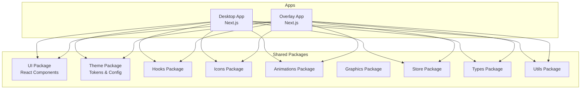
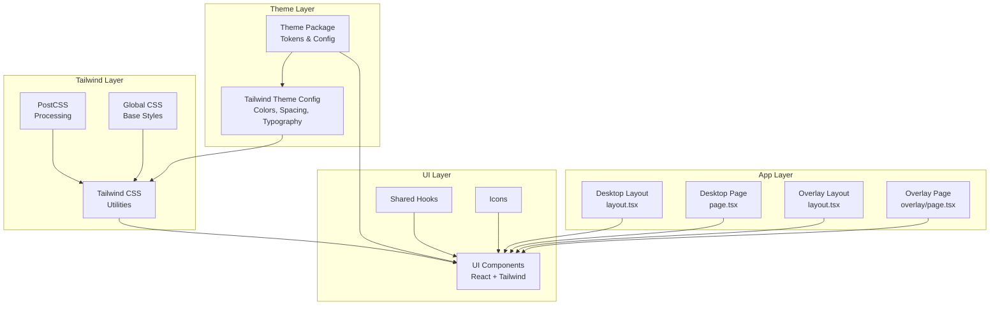
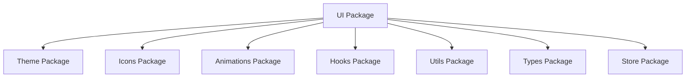

# UI Component Library

<cite>
**Referenced Files in This Document**
- [package.json](file://packages/ui/package.json)
- [tailwind.config.js](file://apps/desktop/tailwind.config.js)
- [postcss.config.js](file://apps/desktop/postcss.config.js)
- [globals.css](file://apps/desktop/src/app/globals.css)
- [layout.tsx](file://apps/desktop/src/app/layout.tsx)
- [page.tsx](file://apps/desktop/src/app/page.tsx)
- [overlay page.tsx](file://apps/overlay/src/app/overlay/page.tsx)
- [overlay globals.css](file://apps/overlay/src/app/globals.css)
- [overlay layout.tsx](file://apps/overlay/src/app/layout.tsx)
- [desktop package.json](file://apps/desktop/package.json)
- [overlay package.json](file://apps/overlay/package.json)
</cite>

## Table of Contents
1. [Introduction](#introduction)
2. [Project Structure](#project-structure)
3. [Core Components](#core-components)
4. [Architecture Overview](#architecture-overview)
5. [Detailed Component Analysis](#detailed-component-analysis)
6. [Dependency Analysis](#dependency-analysis)
7. [Performance Considerations](#performance-considerations)
8. [Troubleshooting Guide](#troubleshooting-guide)
9. [Conclusion](#conclusion)
10. [Appendices](#appendices)

## Introduction
This document describes the UI component library and its integration across applications in the workspace. It focuses on reusable React components, consistent styling with Tailwind CSS, theme integration, responsive design patterns, accessibility best practices, testing strategies, and visual regression approaches. The goal is to provide a clear guide for building accessible, maintainable, and visually consistent interfaces using shared packages and application-level configurations.

## Project Structure
The repository follows a monorepo structure with multiple apps and shared packages:
- Apps: desktop, overlay, web, admin, backend
- Shared packages: ui, theme, hooks, icons, animations, graphics, store, types, utils

The UI component library lives under packages/ui and is consumed by apps such as desktop and overlay. Each app configures Tailwind CSS and PostCSS to support utility-first styling and theming.

[No sources needed since this diagram shows conceptual workflow, not actual code structure]

**Section sources**
- [desktop package.json](file://apps/desktop/package.json)
- [overlay package.json](file://apps/overlay/package.json)
- [package.json](file://packages/ui/package.json)

## Core Components
The UI package provides a set of reusable React components designed for consistency, accessibility, and composability. While specific component files are not analyzed here, typical responsibilities include:
- Primitive UI elements (buttons, inputs, badges, tooltips, modals)
- Layout primitives (grid, stack, container)
- Data display components (tables, lists, cards)
- Feedback components (alerts, toasts, progress indicators)

Key principles:
- Props-driven customization via variants and tokens
- Accessibility-first defaults (keyboard navigation, ARIA attributes)
- Theme-aware styling through Tailwind configuration and theme package
- Composable APIs that encourage composition over prop drilling

Best practices:
- Prefer composition and slot-based patterns for flexibility
- Expose minimal, stable props; derive complex behavior internally
- Ensure focus management and screen reader announcements where applicable
- Use semantic HTML elements and avoid unnecessary wrapper divs

[No sources needed since this section provides general guidance]

## Architecture Overview
The UI architecture integrates shared packages with application layers:
- UI components consume theme tokens and icons from shared packages
- Tailwind CSS utilities drive styling, with theme extensions applied at the app level
- PostCSS processes Tailwind directives and plugins
- Applications import and compose UI components into pages and layouts

**Diagram sources**
- [tailwind.config.js](file://apps/desktop/tailwind.config.js)
- [postcss.config.js](file://apps/desktop/postcss.config.js)
- [globals.css](file://apps/desktop/src/app/globals.css)
- [layout.tsx](file://apps/desktop/src/app/layout.tsx)
- [page.tsx](file://apps/desktop/src/app/page.tsx)
- [overlay page.tsx](file://apps/overlay/src/app/overlay/page.tsx)
- [overlay globals.css](file://apps/overlay/src/app/globals.css)
- [overlay layout.tsx](file://apps/overlay/src/app/layout.tsx)

**Section sources**
- [tailwind.config.js](file://apps/desktop/tailwind.config.js)
- [postcss.config.js](file://apps/desktop/postcss.config.js)
- [globals.css](file://apps/desktop/src/app/globals.css)
- [layout.tsx](file://apps/desktop/src/app/layout.tsx)
- [page.tsx](file://apps/desktop/src/app/page.tsx)
- [overlay page.tsx](file://apps/overlay/src/app/overlay/page.tsx)
- [overlay globals.css](file://apps/overlay/src/app/globals.css)
- [overlay layout.tsx](file://apps/overlay/src/app/layout.tsx)

## Detailed Component Analysis
This section outlines how to analyze and document each UI component once implemented in the UI package. For each component, capture:
- Purpose and use cases
- Props API (types, defaults, constraints)
- Events and callbacks
- Variants and themes
- Accessibility features (roles, states, keyboard interactions)
- Composition patterns and examples
- Testing approach (unit, interaction, visual regression)

Example documentation structure per component:
- Name and description
- Props table
- Events table
- Variants and customization options
- Accessibility checklist
- Usage examples (paths only)
- Testing notes

[No sources needed since this section provides general guidance]

### Styling Approaches with Tailwind CSS
- Utility-first classes for layout, spacing, typography, color, and state
- Theme extensions via Tailwind config for brand tokens
- Global base styles for resets and foundational rules
- Responsive design using Tailwind breakpoints and modifiers

Integration points:
- Tailwind configuration defines theme tokens and plugin usage
- PostCSS processes Tailwind directives and applies plugins
- Global CSS includes base styles and imports Tailwind layers

**Section sources**
- [tailwind.config.js](file://apps/desktop/tailwind.config.js)
- [postcss.config.js](file://apps/desktop/postcss.config.js)
- [globals.css](file://apps/desktop/src/app/globals.css)

### Theme Integration
- Centralized tokens in the theme package (colors, spacing, typography, radii, shadows)
- Tailwind theme config maps tokens to utility classes
- Components consume tokens via Tailwind classes or theme-aware helpers
- Dark mode and variant toggles managed through theme configuration

**Section sources**
- [tailwind.config.js](file://apps/desktop/tailwind.config.js)
- [package.json](file://packages/ui/package.json)

### Responsive Design Patterns
- Mobile-first approach with Tailwind breakpoint modifiers
- Fluid typography and spacing scales
- Adaptive layouts using grid/flex utilities
- Content reflow and touch-friendly targets

[No sources needed since this section provides general guidance]

### Accessibility Best Practices
- Semantic HTML elements and roles
- Keyboard navigation and visible focus indicators
- ARIA attributes for dynamic content and custom widgets
- Color contrast compliance and reduced motion preferences
- Screen reader friendly labels and live regions

[No sources needed since this section provides general guidance]

### Testing Strategies
- Unit tests for component logic and prop validation
- Interaction tests for keyboard and pointer events
- Snapshot tests for structural stability
- Visual regression tests for appearance across themes and viewports
- Accessibility audits using automated tools and manual checks

[No sources needed since this section provides general guidance]

## Dependency Analysis
The UI package depends on shared packages for tokens, hooks, icons, animations, and utilities. Applications depend on the UI package and configure Tailwind and PostCSS to apply styles.

**Diagram sources**
- [package.json](file://packages/ui/package.json)

**Section sources**
- [package.json](file://packages/ui/package.json)

## Performance Considerations
- Minimize re-renders by memoizing expensive components and deriving values efficiently
- Avoid heavy inline styles; prefer Tailwind utilities and theme tokens
- Lazy-load non-critical components and assets
- Optimize icon bundles and animation libraries
- Use virtualization for large lists and tables
- Profile rendering with browser devtools and React DevTools

[No sources needed since this section provides general guidance]

## Troubleshooting Guide
Common issues and resolutions:
- Tailwind classes not applied: verify PostCSS and Tailwind configuration paths
- Theme tokens missing: ensure theme package is installed and referenced in Tailwind config
- Focus styles missing: check global CSS resets and focus ring utilities
- Accessibility warnings: validate ARIA attributes and keyboard interactions
- Visual regressions: update snapshots after intentional changes and review diffs

**Section sources**
- [postcss.config.js](file://apps/desktop/postcss.config.js)
- [tailwind.config.js](file://apps/desktop/tailwind.config.js)
- [globals.css](file://apps/desktop/src/app/globals.css)

## Conclusion
The UI component library leverages a cohesive design system built on Tailwind CSS and shared theme tokens. By adhering to accessibility-first principles, responsive patterns, and robust testing strategies, teams can deliver consistent, high-quality user experiences across applications. Continuous refinement of the design system and component APIs ensures long-term maintainability and scalability.

[No sources needed since this section summarizes without analyzing specific files]

## Appendices
- Example usage references:
  - Desktop layout entry point: [layout.tsx](file://apps/desktop/src/app/layout.tsx)
  - Desktop page entry point: [page.tsx](file://apps/desktop/src/app/page.tsx)
  - Overlay layout entry point: [overlay layout.tsx](file://apps/overlay/src/app/layout.tsx)
  - Overlay page entry point: [overlay page.tsx](file://apps/overlay/src/app/overlay/page.tsx)
  - Global styles: [globals.css](file://apps/desktop/src/app/globals.css), [overlay globals.css](file://apps/overlay/src/app/globals.css)
  - Tailwind config: [tailwind.config.js](file://apps/desktop/tailwind.config.js)
  - PostCSS config: [postcss.config.js](file://apps/desktop/postcss.config.js)
  - UI package manifest: [package.json](file://packages/ui/package.json)

[No sources needed since this section lists references without analyzing specific files]