# Troubleshooting and FAQ

<cite>
**Referenced Files in This Document**
- [package.json](file://apps/desktop/package.json)
- [next.config.js](file://apps/desktop/next.config.js)
- [tsconfig.json](file://apps/desktop/tsconfig.json)
- [tailwind.config.js](file://apps/desktop/tailwind.config.js)
- [postcss.config.js](file://apps/desktop/postcss.config.js)
- [index.ts](file://apps/desktop/src/main/index.ts)
- [websocket.ts](file://apps/desktop/src/main/websocket.ts)
- [database.ts](file://apps/desktop/src/main/database.ts)
- [preload/index.ts](file://apps/desktop/src/preload/index.ts)
- [layout.tsx](file://apps/desktop/src/app/layout.tsx)
- [page.tsx](file://apps/desktop/src/app/page.tsx)
- [match/[id]/page.tsx](file://apps/desktop/src/app/match/[id]/page.tsx)
- [match/live/page.tsx](file://apps/desktop/src/app/match/live/page.tsx)
- [match/setup/page.tsx](file://apps/desktop/src/app/match/setup/page.tsx)
- [settings/page.tsx](file://apps/desktop/src/app/settings/page.tsx)
- [teams/page.tsx](file://apps/desktop/src/app/teams/page.tsx)
- [overlay/page.tsx](file://apps/overlay/src/app/overlay/page.tsx)
- [overlay/layout.tsx](file://apps/overlay/src/app/layout.tsx)
- [overlay/page.tsx](file://apps/overlay/src/app/page.tsx)
- [overlay/next.config.js](file://apps/overlay/next.config.js)
- [overlay/package.json](file://apps/overlay/package.json)
- [packages/store/index.ts](file://packages/store/index.ts)
- [packages/graphics/index.ts](file://packages/graphics/index.ts)
- [packages/animations/index.ts](file://packages/animations/index.ts)
- [turbo.json](file://turbo.json)
- [pnpm-workspace.yaml](file://pnpm-workspace.yaml)
</cite>

## Table of Contents
1. [Introduction](#introduction)
2. [Project Structure](#project-structure)
3. [Core Components](#core-components)
4. [Architecture Overview](#architecture-overview)
5. [Detailed Component Analysis](#detailed-component-analysis)
6. [Dependency Analysis](#dependency-analysis)
7. [Performance Considerations](#performance-considerations)
8. [Troubleshooting Guide](#troubleshooting-guide)
9. [Conclusion](#conclusion)
10. [Appendices](#appendices)

## Introduction
This document provides comprehensive troubleshooting and frequently asked questions for AR Sports, covering development, deployment, and production issues. It focuses on Electron application debugging, Next.js configuration problems, WebSocket connectivity, graphics rendering performance, platform-specific concerns, dependency conflicts, build failures, log analysis, and profiling techniques. It also includes architectural FAQs, configuration guidance, known limitations, workarounds, and community resources.

## Project Structure
AR Sports is a monorepo with multiple apps and shared packages:
- Desktop app (Electron + Next.js renderer)
- Overlay app (Next.js overlay UI)
- Shared packages (store, graphics, animations, etc.)
- Workspace tooling (Turbo, pnpm)

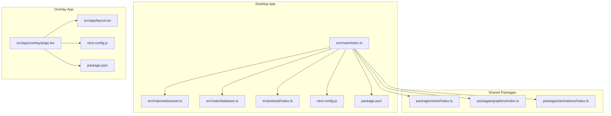

**Diagram sources**
- [index.ts](file://apps/desktop/src/main/index.ts)
- [websocket.ts](file://apps/desktop/src/main/websocket.ts)
- [database.ts](file://apps/desktop/src/main/database.ts)
- [preload/index.ts](file://apps/desktop/src/preload/index.ts)
- [next.config.js](file://apps/desktop/next.config.js)
- [package.json](file://apps/desktop/package.json)
- [overlay/page.tsx](file://apps/overlay/src/app/overlay/page.tsx)
- [overlay/layout.tsx](file://apps/overlay/src/app/layout.tsx)
- [overlay/next.config.js](file://apps/overlay/next.config.js)
- [overlay/package.json](file://apps/overlay/package.json)
- [packages/store/index.ts](file://packages/store/index.ts)
- [packages/graphics/index.ts](file://packages/graphics/index.ts)
- [packages/animations/index.ts](file://packages/animations/index.ts)

**Section sources**
- [turbo.json](file://turbo.json)
- [pnpm-workspace.yaml](file://pnpm-workspace.yaml)
- [package.json](file://apps/desktop/package.json)
- [next.config.js](file://apps/desktop/next.config.js)
- [overlay/next.config.js](file://apps/overlay/next.config.js)

## Core Components
- Electron main process entry point orchestrates the desktop app lifecycle, window management, IPC, and integration with Next.js renderer.
- WebSocket manager handles real-time connections used by live match features.
- Database module manages local persistence for settings, teams, and match data.
- Preload script exposes secure APIs to the renderer via contextBridge.
- Next.js pages implement UI for matches, live view, setup, settings, and teams.
- Overlay app renders an independent Next.js page for broadcast overlays.
- Shared packages provide store state, graphics utilities, and animation helpers.

Key responsibilities and interactions are visualized below.

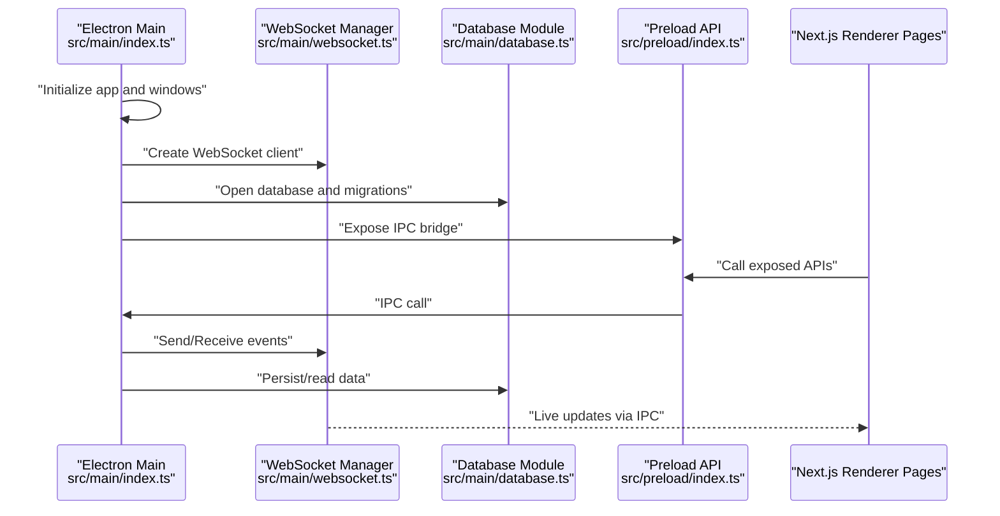

**Diagram sources**
- [index.ts](file://apps/desktop/src/main/index.ts)
- [websocket.ts](file://apps/desktop/src/main/websocket.ts)
- [database.ts](file://apps/desktop/src/main/database.ts)
- [preload/index.ts](file://apps/desktop/src/preload/index.ts)
- [page.tsx](file://apps/desktop/src/app/page.tsx)
- [match/live/page.tsx](file://apps/desktop/src/app/match/live/page.tsx)

**Section sources**
- [index.ts](file://apps/desktop/src/main/index.ts)
- [websocket.ts](file://apps/desktop/src/main/websocket.ts)
- [database.ts](file://apps/desktop/src/main/database.ts)
- [preload/index.ts](file://apps/desktop/src/preload/index.ts)
- [layout.tsx](file://apps/desktop/src/app/layout.tsx)
- [page.tsx](file://apps/desktop/src/app/page.tsx)
- [match/[id]/page.tsx](file://apps/desktop/src/app/match/[id]/page.tsx)
- [match/live/page.tsx](file://apps/desktop/src/app/match/live/page.tsx)
- [match/setup/page.tsx](file://apps/desktop/src/app/match/setup/page.tsx)
- [settings/page.tsx](file://apps/desktop/src/app/settings/page.tsx)
- [teams/page.tsx](file://apps/desktop/src/app/teams/page.tsx)

## Architecture Overview
The system combines an Electron host with a Next.js renderer and a separate overlay app. Real-time data flows through WebSockets managed by the main process and delivered to the renderer via IPC. Local storage is handled by a database module. Shared packages encapsulate cross-cutting concerns like state, graphics, and animations.

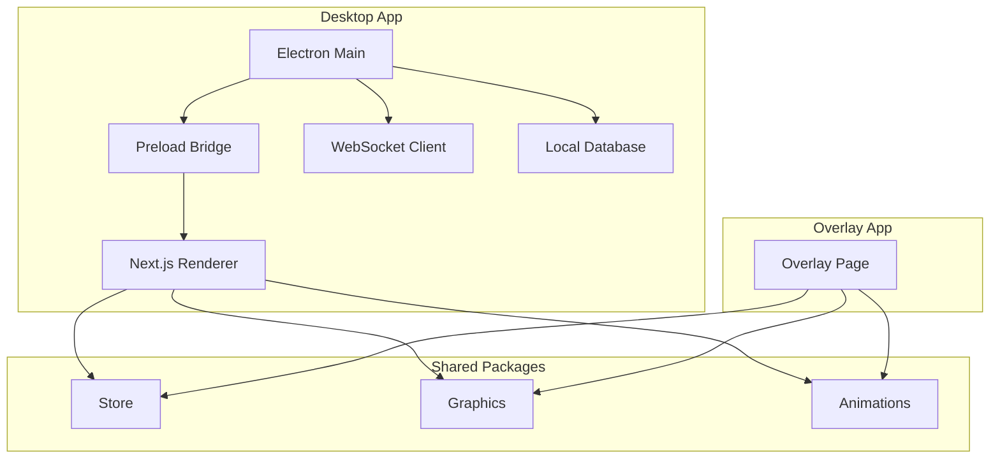

**Diagram sources**
- [index.ts](file://apps/desktop/src/main/index.ts)
- [websocket.ts](file://apps/desktop/src/main/websocket.ts)
- [database.ts](file://apps/desktop/src/main/database.ts)
- [preload/index.ts](file://apps/desktop/src/preload/index.ts)
- [overlay/page.tsx](file://apps/overlay/src/app/overlay/page.tsx)
- [packages/store/index.ts](file://packages/store/index.ts)
- [packages/graphics/index.ts](file://packages/graphics/index.ts)
- [packages/animations/index.ts](file://packages/animations/index.ts)

## Detailed Component Analysis

### Electron Main Process
- Responsibilities: app lifecycle, window creation, preload injection, IPC routing, WebSocket initialization, database startup.
- Common pitfalls: incorrect preload path, missing contextBridge exposure, improper IPC channel names, failing to handle uncaught exceptions.

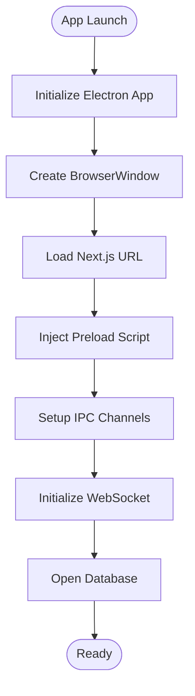

**Diagram sources**
- [index.ts](file://apps/desktop/src/main/index.ts)
- [preload/index.ts](file://apps/desktop/src/preload/index.ts)
- [websocket.ts](file://apps/desktop/src/main/websocket.ts)
- [database.ts](file://apps/desktop/src/main/database.ts)

**Section sources**
- [index.ts](file://apps/desktop/src/main/index.ts)
- [preload/index.ts](file://apps/desktop/src/preload/index.ts)

### WebSocket Manager
- Responsibilities: connection lifecycle, reconnection logic, event routing, error handling, backpressure mitigation.
- Common pitfalls: missing heartbeat/ping-pong, not handling network drops, excessive reconnect storms, memory leaks from listeners.

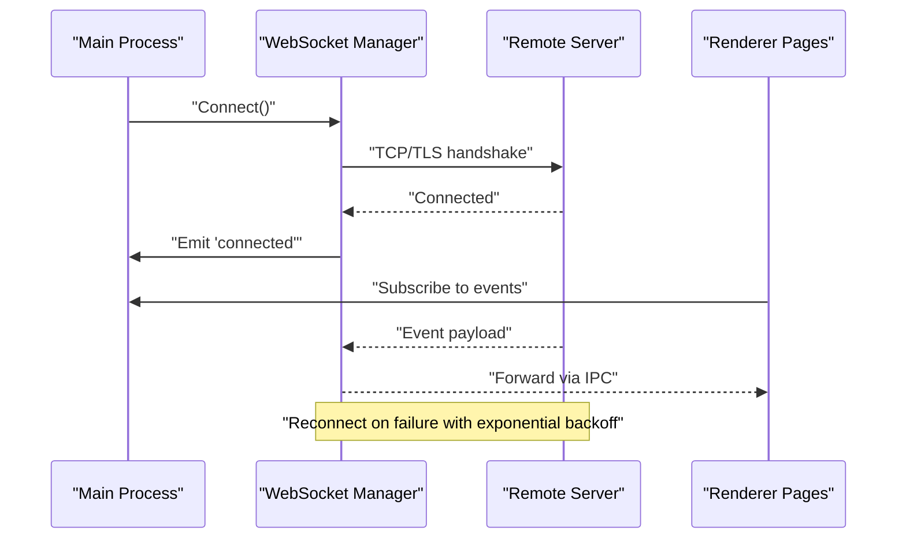

**Diagram sources**
- [websocket.ts](file://apps/desktop/src/main/websocket.ts)
- [index.ts](file://apps/desktop/src/main/index.ts)
- [match/live/page.tsx](file://apps/desktop/src/app/match/live/page.tsx)

**Section sources**
- [websocket.ts](file://apps/desktop/src/main/websocket.ts)
- [match/live/page.tsx](file://apps/desktop/src/app/match/live/page.tsx)

### Database Module
- Responsibilities: schema initialization, CRUD operations, migration handling, transaction boundaries.
- Common pitfalls: schema drift, missing indexes, blocking queries on main thread, insufficient error logging.

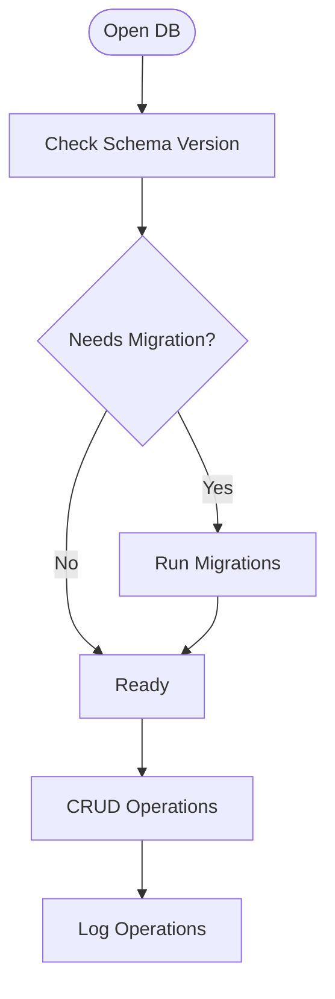

**Diagram sources**
- [database.ts](file://apps/desktop/src/main/database.ts)

**Section sources**
- [database.ts](file://apps/desktop/src/main/database.ts)

### Preload Bridge
- Responsibilities: expose minimal, typed APIs to renderer; sanitize inputs; route IPC calls securely.
- Common pitfalls: exposing too much functionality, missing validation, inconsistent channel naming.

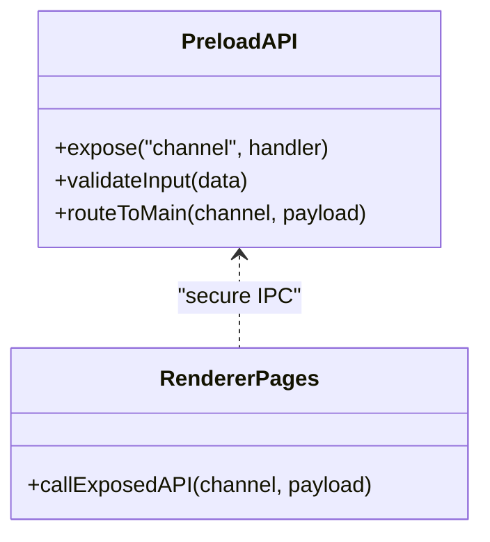

**Diagram sources**
- [preload/index.ts](file://apps/desktop/src/preload/index.ts)
- [page.tsx](file://apps/desktop/src/app/page.tsx)

**Section sources**
- [preload/index.ts](file://apps/desktop/src/preload/index.ts)
- [page.tsx](file://apps/desktop/src/app/page.tsx)

### Next.js Renderer Pages
- Responsibilities: UI for match details, live view, setup, settings, teams; consume store and graphics packages; subscribe to IPC events.
- Common pitfalls: hydration mismatches, incorrect dynamic routes, missing Suspense boundaries, heavy computations on main thread.

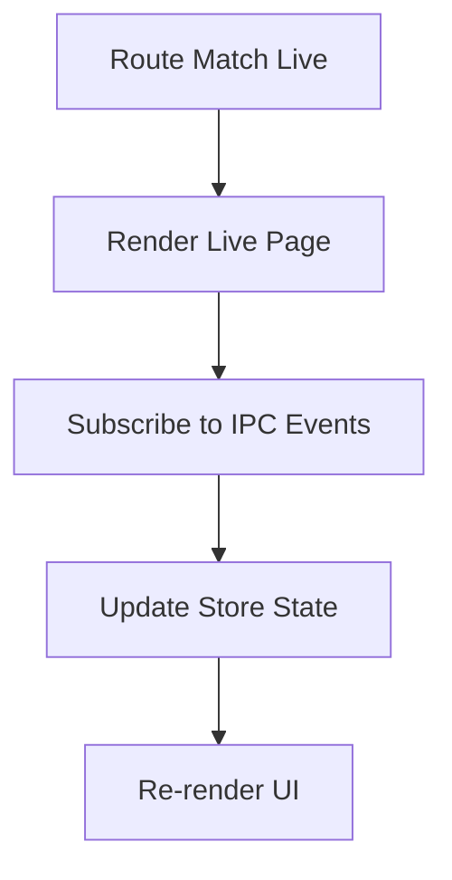

**Diagram sources**
- [match/live/page.tsx](file://apps/desktop/src/app/match/live/page.tsx)
- [match/[id]/page.tsx](file://apps/desktop/src/app/match/[id]/page.tsx)
- [match/setup/page.tsx](file://apps/desktop/src/app/match/setup/page.tsx)
- [settings/page.tsx](file://apps/desktop/src/app/settings/page.tsx)
- [teams/page.tsx](file://apps/desktop/src/app/teams/page.tsx)

**Section sources**
- [match/live/page.tsx](file://apps/desktop/src/app/match/live/page.tsx)
- [match/[id]/page.tsx](file://apps/desktop/src/app/match/[id]/page.tsx)
- [match/setup/page.tsx](file://apps/desktop/src/app/match/setup/page.tsx)
- [settings/page.tsx](file://apps/desktop/src/app/settings/page.tsx)
- [teams/page.tsx](file://apps/desktop/src/app/teams/page.tsx)

### Overlay App
- Responsibilities: standalone Next.js overlay page for broadcast use; shares store and graphics packages.
- Common pitfalls: CORS misconfiguration, asset loading issues, mismatched Next.js versions.

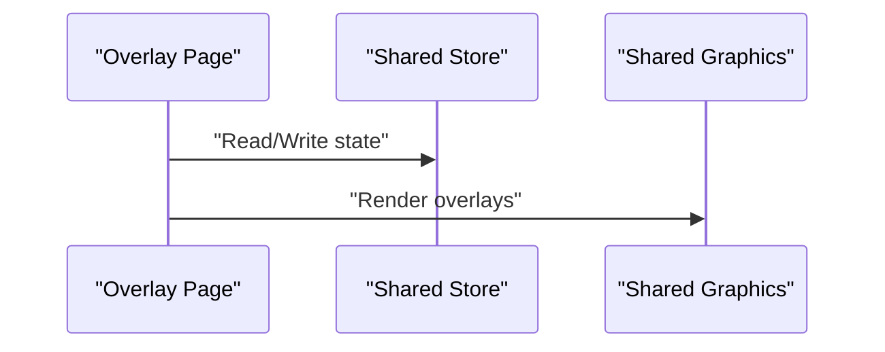

**Diagram sources**
- [overlay/page.tsx](file://apps/overlay/src/app/overlay/page.tsx)
- [overlay/layout.tsx](file://apps/overlay/src/app/layout.tsx)
- [packages/store/index.ts](file://packages/store/index.ts)
- [packages/graphics/index.ts](file://packages/graphics/index.ts)

**Section sources**
- [overlay/page.tsx](file://apps/overlay/src/app/overlay/page.tsx)
- [overlay/layout.tsx](file://apps/overlay/src/app/layout.tsx)
- [overlay/next.config.js](file://apps/overlay/next.config.js)
- [overlay/package.json](file://apps/overlay/package.json)

### Shared Packages
- Store: centralized state management consumed by renderer and overlay.
- Graphics: rendering utilities for overlays and match visuals.
- Animations: helper functions for transitions and effects.

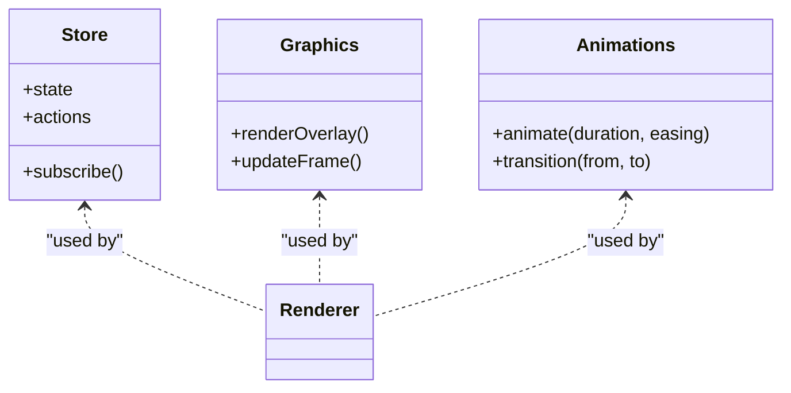

**Diagram sources**
- [packages/store/index.ts](file://packages/store/index.ts)
- [packages/graphics/index.ts](file://packages/graphics/index.ts)
- [packages/animations/index.ts](file://packages/animations/index.ts)

**Section sources**
- [packages/store/index.ts](file://packages/store/index.ts)
- [packages/graphics/index.ts](file://packages/graphics/index.ts)
- [packages/animations/index.ts](file://packages/animations/index.ts)

## Dependency Analysis
Workspace-level dependencies and build orchestration are defined at the root and per-app package manifests. Ensure consistent Node and package manager versions across environments.

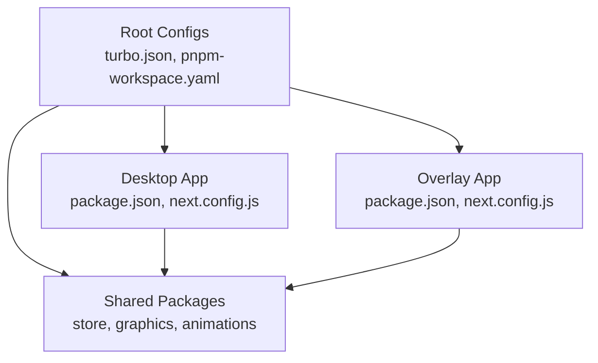

**Diagram sources**
- [turbo.json](file://turbo.json)
- [pnpm-workspace.yaml](file://pnpm-workspace.yaml)
- [package.json](file://apps/desktop/package.json)
- [next.config.js](file://apps/desktop/next.config.js)
- [overlay/package.json](file://apps/overlay/package.json)
- [overlay/next.config.js](file://apps/overlay/next.config.js)

**Section sources**
- [turbo.json](file://turbo.json)
- [pnpm-workspace.yaml](file://pnpm-workspace.yaml)
- [package.json](file://apps/desktop/package.json)
- [next.config.js](file://apps/desktop/next.config.js)
- [overlay/package.json](file://apps/overlay/package.json)
- [overlay/next.config.js](file://apps/overlay/next.config.js)

## Performance Considerations
- Rendering: prefer GPU acceleration where supported; avoid heavy synchronous work in renderers; leverage requestAnimationFrame for smooth animations.
- Data flow: debounce or throttle frequent IPC messages; batch updates; use efficient store subscriptions.
- Networking: implement exponential backoff and jitter for reconnections; set timeouts and heartbeats; monitor bandwidth usage.
- Storage: index frequently queried fields; run migrations off the critical path; consider read replicas for heavy reads if applicable.
- Build: cache artifacts with Turborepo; parallelize tasks; isolate heavy builds into dedicated tasks.

[No sources needed since this section provides general guidance]

## Troubleshooting Guide

### Development Environment Issues
- Node/pnpm version mismatch
  - Symptoms: install errors, lockfile inconsistencies, build failures.
  - Steps:
    - Verify Node and pnpm versions against workspace requirements.
    - Clear caches and reinstall dependencies.
    - Regenerate lockfiles if necessary.
- TypeScript configuration conflicts
  - Symptoms: type errors across packages, unexpected strictness.
  - Steps:
    - Align tsconfig base settings.
    - Ensure paths and module resolution are consistent.
- Tailwind and PostCSS pipeline issues
  - Symptoms: styles not applied, build warnings.
  - Steps:
    - Validate config files for correct content paths and plugins.
    - Purge unused styles if configured.

**Section sources**
- [tsconfig.json](file://apps/desktop/tsconfig.json)
- [tailwind.config.js](file://apps/desktop/tailwind.config.js)
- [postcss.config.js](file://apps/desktop/postcss.config.js)
- [pnpm-workspace.yaml](file://pnpm-workspace.yaml)

### Electron Application Debugging
- Renderer devtools
  - Enable devtools programmatically during development.
  - Inspect console logs, network requests, and performance profiles.
- Main process debugging
  - Attach debugger to the main process.
  - Log IPC channels and payloads carefully.
- Preload isolation
  - Confirm contextBridge exposure and validate input sanitization.
- Window lifecycle
  - Ensure proper cleanup on close; avoid orphaned timers or listeners.

**Section sources**
- [index.ts](file://apps/desktop/src/main/index.ts)
- [preload/index.ts](file://apps/desktop/src/preload/index.ts)

### Next.js Issues
- Hydration mismatches
  - Symptoms: console warnings about mismatched HTML.
  - Steps:
    - Avoid environment-dependent values during SSR.
    - Use useEffect for client-only logic.
- Dynamic routes
  - Symptoms: 404 errors for nested routes.
  - Steps:
    - Verify file-based routing structure and parameter names.
- Asset loading
  - Symptoms: missing images or fonts.
  - Steps:
    - Configure public directories and Next.js asset handling.
- Configuration
  - Symptoms: build/runtime errors due to misconfigured paths or headers.
  - Steps:
    - Review next.config.js for redirects, headers, and custom server options.

**Section sources**
- [next.config.js](file://apps/desktop/next.config.js)
- [match/[id]/page.tsx](file://apps/desktop/src/app/match/[id]/page.tsx)
- [match/live/page.tsx](file://apps/desktop/src/app/match/live/page.tsx)
- [match/setup/page.tsx](file://apps/desktop/src/app/match/setup/page.tsx)
- [settings/page.tsx](file://apps/desktop/src/app/settings/page.tsx)
- [teams/page.tsx](file://apps/desktop/src/app/teams/page.tsx)

### WebSocket Connection Problems
- Connectivity
  - Symptoms: no events received, frequent disconnects.
  - Steps:
    - Verify server URL, ports, and firewall rules.
    - Check TLS certificates and proxy configurations.
- Reconnection strategy
  - Symptoms: reconnect storms or infinite loops.
  - Steps:
    - Implement exponential backoff with jitter.
    - Limit maximum retries and add circuit breaker behavior.
- Event routing
  - Symptoms: stale or duplicate events.
  - Steps:
    - Deduplicate events using IDs or timestamps.
    - Ensure single subscription per component lifecycle.
- Backpressure
  - Symptoms: UI lag under high throughput.
  - Steps:
    - Throttle or sample incoming events.
    - Batch updates to the store.

**Section sources**
- [websocket.ts](file://apps/desktop/src/main/websocket.ts)
- [index.ts](file://apps/desktop/src/main/index.ts)
- [match/live/page.tsx](file://apps/desktop/src/app/match/live/page.tsx)

### Graphics Rendering Performance
- Frame rate drops
  - Symptoms: stuttering overlays or animations.
  - Steps:
    - Profile GPU usage and frame times.
    - Reduce draw calls and texture sizes.
    - Use requestAnimationFrame and avoid layout thrashing.
- Memory leaks
  - Symptoms: increasing memory over time.
  - Steps:
    - Dispose textures and canvases when components unmount.
    - Remove event listeners and timers.
- Shader or effect issues
  - Symptoms: visual artifacts or crashes.
  - Steps:
    - Validate shader compatibility with target GPUs.
    - Add fallbacks for unsupported features.

**Section sources**
- [packages/graphics/index.ts](file://packages/graphics/index.ts)
- [packages/animations/index.ts](file://packages/animations/index.ts)
- [match/live/page.tsx](file://apps/desktop/src/app/match/live/page.tsx)

### Platform-Specific Problems
- Windows
  - Symptoms: certificate errors, antivirus false positives.
  - Steps:
    - Sign the executable; whitelist the app directory.
    - Adjust security policies for local servers.
- macOS
  - Symptoms: sandbox restrictions, notarization failures.
  - Steps:
    - Follow Apple signing and notarization steps.
    - Request required permissions in Info.plist.
- Linux
  - Symptoms: missing system libraries, Wayland vs X11 issues.
  - Steps:
    - Install required dependencies.
    - Set environment variables for GPU acceleration.

[No sources needed since this section provides general guidance]

### Dependency Conflicts and Build Failures
- Monorepo inconsistencies
  - Symptoms: peer dependency warnings, runtime errors.
  - Steps:
    - Enforce consistent versions across packages.
    - Use workspace protocols and hoisting strategies.
- Turborepo caching issues
  - Symptoms: stale outputs after code changes.
  - Steps:
    - Invalidate caches selectively.
    - Mark tasks with accurate inputs/outputs.
- Next.js build errors
  - Symptoms: compilation failures, missing modules.
  - Steps:
    - Clean node_modules and rebuild.
    - Validate external dependencies and native modules.

**Section sources**
- [turbo.json](file://turbo.json)
- [pnpm-workspace.yaml](file://pnpm-workspace.yaml)
- [package.json](file://apps/desktop/package.json)
- [overlay/package.json](file://apps/overlay/package.json)

### Diagnostic Tools and Log Analysis
- Electron DevTools
  - Use Console, Network, Sources, and Performance panels.
  - Capture heap snapshots to identify leaks.
- Main process logs
  - Centralize logs with structured formats.
  - Include correlation IDs for IPC and WebSocket events.
- Overlay diagnostics
  - Separate logs for overlay app to isolate issues.
- Profiling
  - Use CPU and memory profilers in DevTools.
  - Measure frame times and GC pauses.

**Section sources**
- [index.ts](file://apps/desktop/src/main/index.ts)
- [websocket.ts](file://apps/desktop/src/main/websocket.ts)
- [overlay/page.tsx](file://apps/overlay/src/app/overlay/page.tsx)

### Best Practices Checklist
- Validate all inputs before IPC and WebSocket transmission.
- Implement robust error boundaries and user-friendly error messages.
- Keep configs declarative and version-controlled.
- Prefer immutable state updates in the store.
- Use feature flags for experimental functionality.

[No sources needed since this section provides general guidance]

## Conclusion
This guide consolidates common issues and solutions across the AR Sports stack, focusing on Electron, Next.js, WebSocket connectivity, and graphics performance. By following the diagnostic steps, leveraging provided tools, and adhering to best practices, teams can reduce downtime and improve reliability in both development and production environments.

[No sources needed since this section summarizes without analyzing specific files]

## Appendices

### Frequently Asked Questions

- Why does the overlay app fail to load assets?
  - Ensure correct public directory configuration and Next.js asset handling.
  - Verify relative paths and environment variables.

- How do I enable debug logging for WebSocket events?
  - Add structured logging around connect, send, receive, and error handlers.
  - Include timestamps and correlation IDs.

- What causes hydration warnings in Next.js pages?
  - Avoid SSR-incompatible logic; defer client-only operations to useEffect.

- How can I prevent reconnect storms?
  - Implement exponential backoff with jitter and maximum retry limits.

- How do I profile rendering performance?
  - Use DevTools Performance panel; capture frames and analyze GPU usage.

- Where should I configure Tailwind content paths?
  - In Tailwind config, specify all relevant source files and directories.

- How do I manage shared package versions?
  - Use workspace protocols and enforce consistency via CI checks.

**Section sources**
- [overlay/next.config.js](file://apps/overlay/next.config.js)
- [websocket.ts](file://apps/desktop/src/main/websocket.ts)
- [layout.tsx](file://apps/desktop/src/app/layout.tsx)
- [tailwind.config.js](file://apps/desktop/tailwind.config.js)
- [pnpm-workspace.yaml](file://pnpm-workspace.yaml)